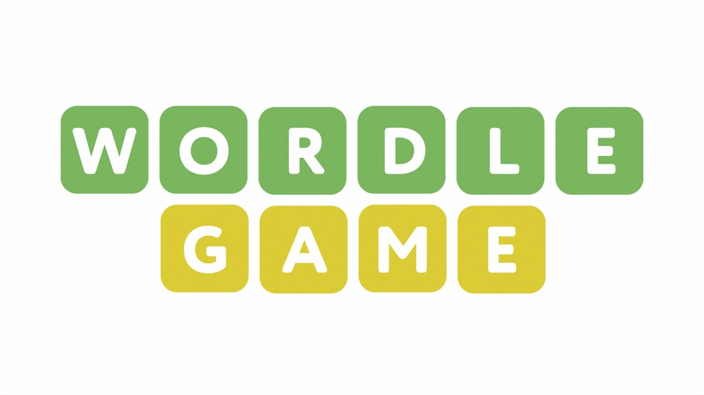
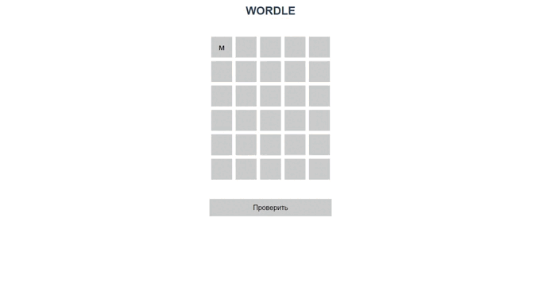
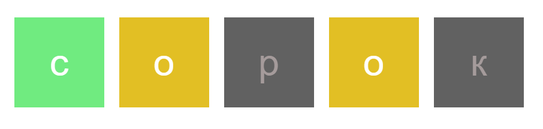
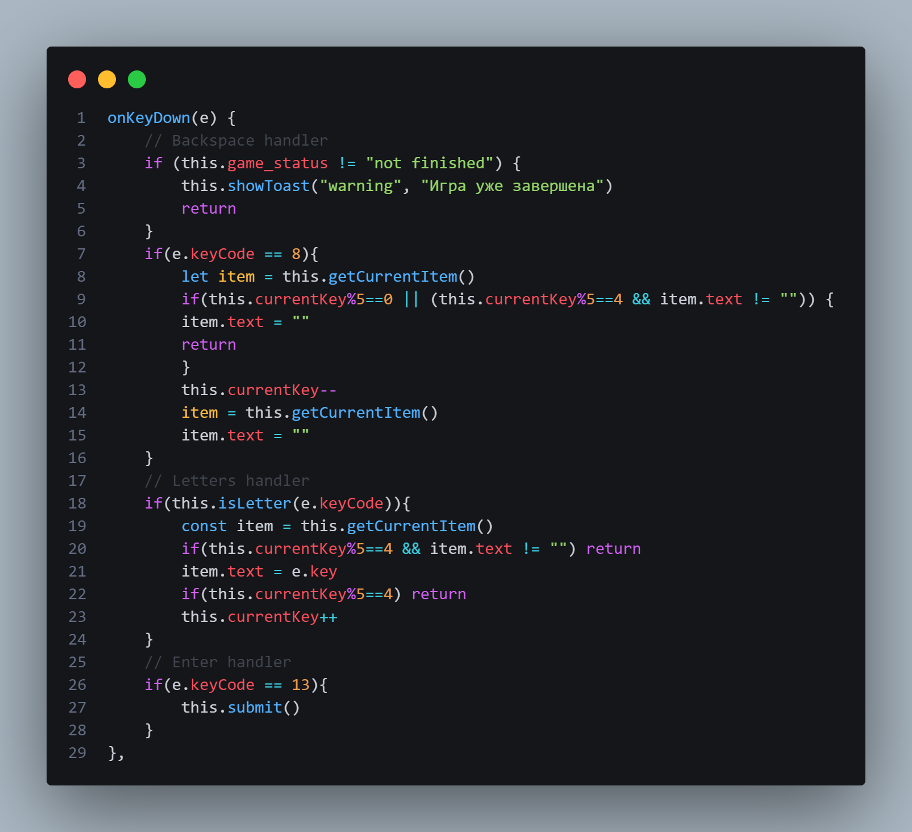
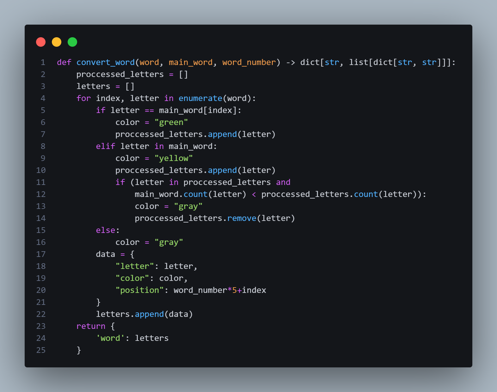
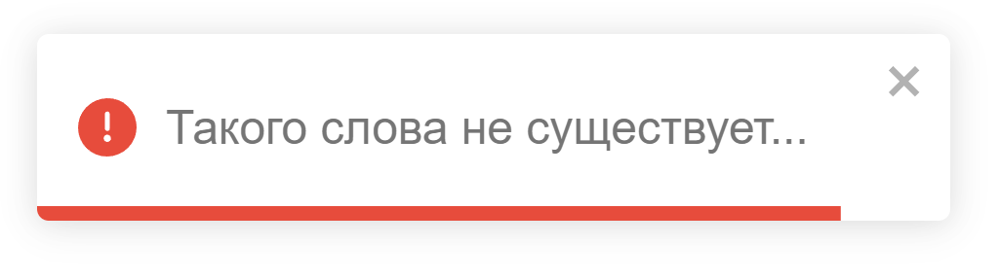
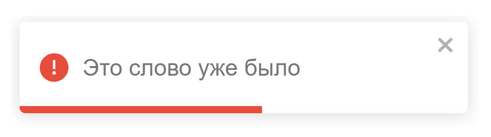

<h1 align="center">
  <br>
  </a>
  <br>
  wordle web
  <br>
</h1>

<h4 align="center">the most interesting word game</h4>

<p align="center">
  <a href="https://www.mongodb.com/">
    
  </a>
  <a href="https://learn.javascript.ru/"></a>
  <a href="https://ru.vuejs.org/">
      
  </a>
  <a href="https://www.python.org/">
    
  </a>
  <a href="https://fastapi.tiangolo.com/">
    
  </a>
</p>


<p align="center">
  <a href="#games-rules">Game's rules</a> •
  <a href="#installation">Installation</a> •
  <a href="#launch">Launch</a> •
  <a href="#algorithms">Algorithms</a> •
  <a href="#about-project">About project</a> •
  <a href="#about-me">About me</a>
</p>



## Game's rules

* Guess the hidden word in six attempts. After each attempt, the color of the letters will change to show which letters are in the hidden word!
  - The green letter is in the hidden word and is in the right place
  - The yellow letter is in the hidden word, but it is in the wrong place
  - If the letter is gray, then it is not in the hidden word
> For example, the hidden word is 'слово'
> 
## Installation

To clone and run this application, you'll need Git, Node.js, python and mongodb.

```bash
# Clone this repository
$ git clone https://github.com/psihoshlem/wordle_web_game.git

# Go into the server's folder
$ cd server

# Create virtual environment
$ python -m venv venv

$ ./venv/Scripts/Activate.ps1

# Install dependencies
$ pip install requirements.txt

# Go back
$ cd ..

# Go into the server's folder
$ cd wordle

# Install dependencies
$ npm i
```


## Launch

To run project open 3 terminals:

- to run server
```bash
$ cd server
$ ./venv/Scripts/Activate.ps1
$ python main.py
```
- to run client
```bash
$ cd wordle
$ npm run serve
```
- to run database
```bash
$ mongod --dbpath ./database
```

## Algorithms

- Processing keystrokes



- Word processing involves determining the color of each letter



## About project

This is not a new idea. I worked on this to consolidate my knowledge, as well as to gain skills working with mongodb.
The project was based on the wordle game. The letters are entered from the keyboard, after which the word is sent to the server where the word is processed (that is, the color of each letter is determined) and the word is recorded in the database.

If the word was entered earlier or it does not exist, the user will receive a corresponding notification.


## About me

I am studying to be a software developer in the 3rd year. I position myself as a full-stack developer. My stack is currently vue.js and python/fastapi.


---

> GitHub [@psihoshlem](https://github.com/psihoshlem) 
> Gmail [yungync@gmail.com](https://gmail.com/)
